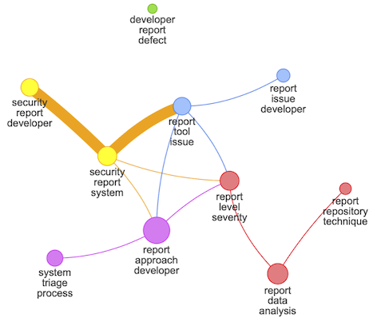
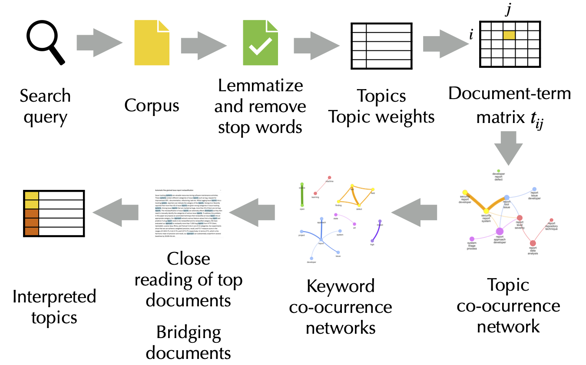

# Topic Model Explorer

This is a tool for exploring topic models built on top of [streamlit.io](https://www.streamlit.io). It requires gensim, graphviz, pyvis, networkx, and nltk.

There are two versions of the tool with different objectives:

## tme.py



Supports the workflow to create topic co-occurrence networks and keyword co-occurrence networks. To use this tool, run:

```
streamlit run tme.py
```

To learn more about the approach behind the tool you can watch the video of my talk at Networks 2021:

[](https://www.youtube.com/watch?v=KeScI6S7aag)

## tme-s.py 

Creates a synthesis of multiple runs of a topic model. This is important when using short documents, as there can be quite some variation between individual runs.

```
streamlit run tme-s.py
```